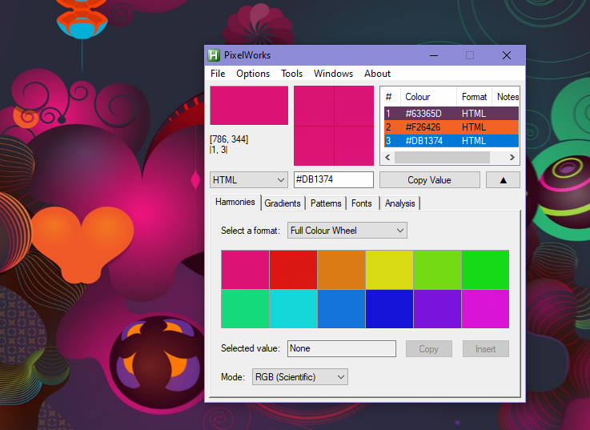
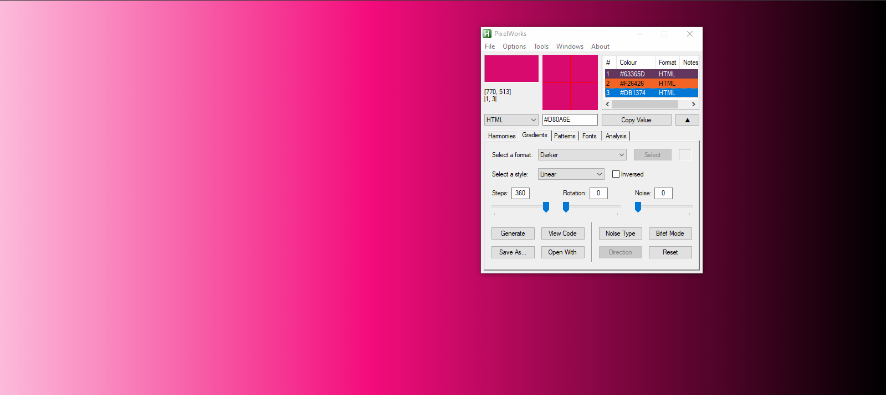
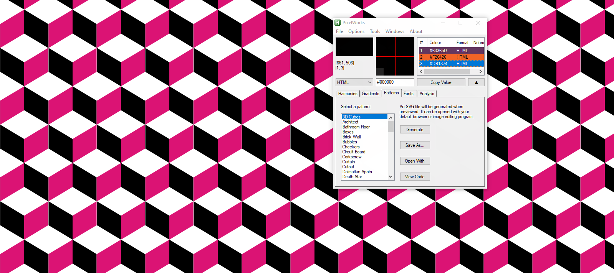
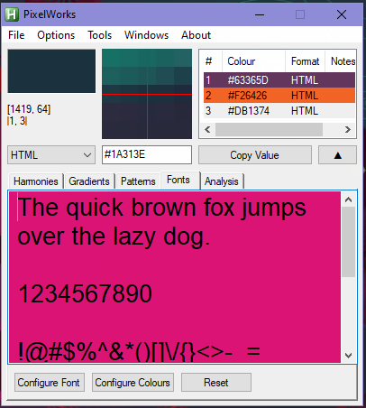
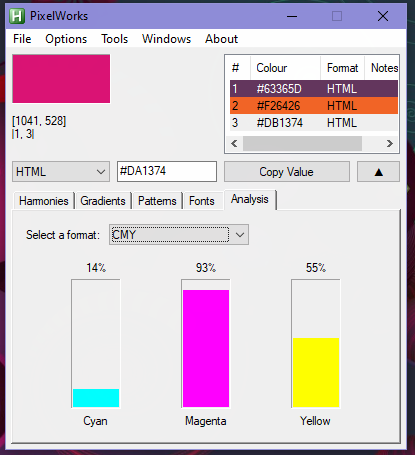
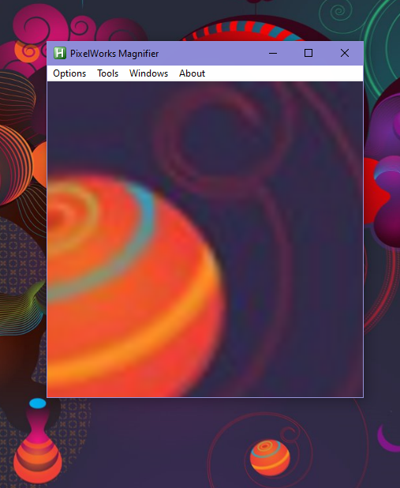
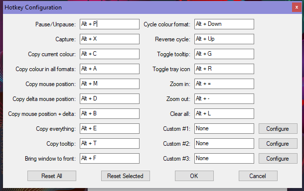
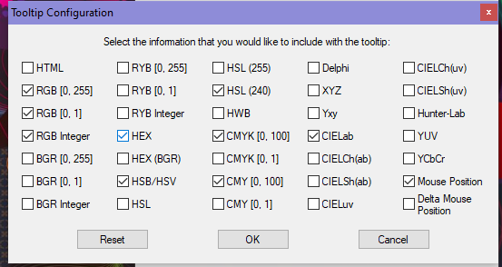
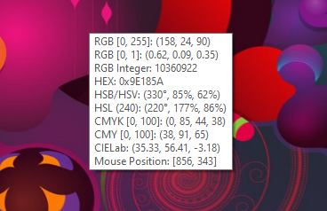

# PixelWorks
<em> An advanced color picker tool </em>

This is a work in progress! It is in the process of being rewritten.
<h3> Screenshots </h3>

|  |
|:--:|
| <b>Main UI</b>|

|  |
|:--:|
| <b>Gradient generator</b>|

|  |
|:--:|
| <b>Pattern generator</b>|

|  |
|:--:|
| <b>Font preview</b>|

|  |
|:--:|
| <b>Color analysis</b>|

|  |
|:--:|
| <b>Magnifier mode</b>|

|  |
|:--:|
| <b>Custom hotkeys</b>|

|  |
|:--:|
| <b>Custom tooltips</b>|

|  |
|:--:|
| <b>Tooltip mode</b>|
